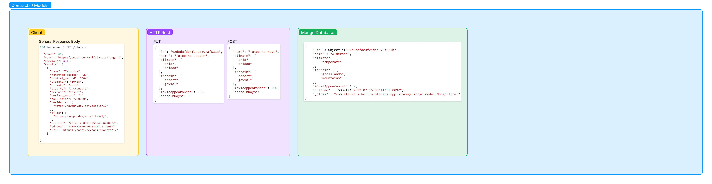

# 
 API Design 

The API design consists in the steps to being followed to use the Rest API, including `POST`, `GET`, `PUT` and `DELETE` operations

The flow to be followed is drawn in the diagram in the next section.

### 
 Saving Money/Requests Strategy 

One of the main purposes of this API is to save requests to the SWAPI client using an own database, so, part of the flow is to know how much older the data can be since the last request, getting this info from the consumer of the API.

**Example 1:** Imagine you need to know what is the climate of a certain planet, you also know that a climate doesn't change in a few days, so, you can ask to the API to have a planet which could have been already requested in the last 365 days, so, we'll search in a database a planet with at most 365 `cacheInDays`, if each request to the client costs $0.80 you will save $0.80 from every request in the last 365 days.

But if there is no planet requested in the last 365 days, example, the last saved planet was requested and saved in 400 days ago, we will just request it to the client and save with the creation date as today, so, the cache in days will be 0 for today, and we'll return it.

**Example 2:** Now imagine you want to know what is the number of movies a planet appeared, and for this, you need the most updated info, no space for errors or anything like this, so you can request a planet with 0 cache in days, knowing that, we will directly ask for the client to get the most recent info for you, but using a `cacheInDays` as 0, you will ever pay the $0.80 cents to request info directly from the client.

## 
 Design 

 <a href="https://www.figma.com/file/MZIkN6HRJLCbxZXgIxJ08B/Star-Wars-API?node-id=0%3A1" target="_blank"> Original Figma Design </a>

### 
 Contracts 

### 
 Flow 

